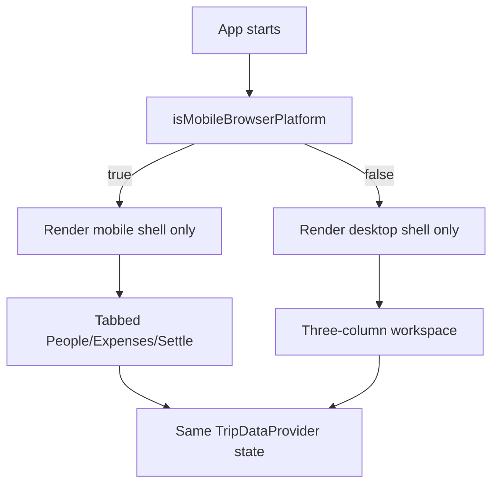
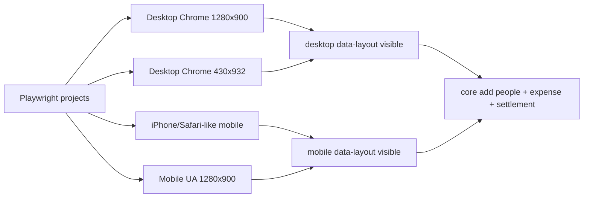
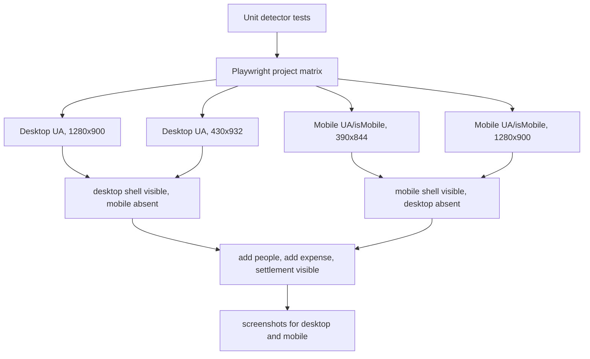

# Travel Split Platform Layout Selection - Senior Engineering Exit Review

## Context

Review target: choose Travel Split's mobile vs desktop layout by browser platform, not by viewport width.

User preference under review:

- If the app is running on a mobile browser platform, render the mobile tabbed layout.
- Otherwise, render the desktop three-column workspace.
- Prefer runtime UI testing across multiple scenarios.
- Use TDD red/green before implementation.

Current observed implementation state:

- `src/App.tsx` currently renders only one layout branch from `usePlatformLayout()`.
- `src/ui/usePlatformLayout.ts` currently checks `navigator.userAgentData.mobile`, then falls back to a mobile user-agent regex.
- `src/ui/usePlatformLayout.test.ts` has unit coverage for `userAgentData.mobile`, iPhone UA fallback, and desktop UA fallback.
- `e2e/travel-split.spec.ts` has mobile and desktop flows, but the mobile flow currently only sets viewport size; that is not a valid platform test once layout depends on browser platform instead of viewport.
- Existing data/domain/persistence tests already pass in prior runs and should remain unchanged.

## Selected Scope Lens

**Scope reduction** — implement the smallest safe version of platform-based layout selection, with runtime UI tests that actually exercise platform differences.

## Scope Challenge

### What already exists?

- **Two UI shells exist:** mobile tab shell and desktop workspace shell are already represented in `src/App.tsx`.
- **Reusable screen components exist:** `PeopleScreen`, `ExpensesScreen`, and `SettleScreen` are shared by mobile and desktop.
- **Platform detector exists:** `usePlatformLayout()` and `isMobileBrowserPlatform()` already provide a single decision seam.
- **Unit tests exist:** `usePlatformLayout.test.ts` covers the detector logic.
- **Runtime tests exist:** `e2e/travel-split.spec.ts` covers core flows, but the mobile runtime test is currently viewport-based and therefore not aligned with the platform-selection requirement.
- **Desktop mockup exists:** `design/01-desktop-workspace.html` provides visual direction for desktop workspace.

### Minimum viable change

The smallest safe target is:

1. Keep a single explicit detector module: `isMobileBrowserPlatform()`.
2. Render exactly one shell: mobile or desktop. Do not render hidden duplicate shells.
3. Treat platform detection as **initial-load only** for v1. Do not dynamically switch layouts after user-agent/platform changes.
4. Replace viewport-only mobile Playwright validation with real mobile emulation via Playwright project/device settings or per-test `userAgent` + `isMobile` context.
5. Add a small runtime test matrix:
   - desktop browser + wide viewport → desktop workspace
   - desktop browser + narrow viewport → desktop workspace
   - mobile browser emulation + phone viewport → mobile tab shell
   - mobile browser emulation + wide viewport → mobile tab shell, if this rule is intentional
6. Keep responsive CSS only for polish inside each selected layout, not for choosing which shell renders.

### Complexity smell

Do not introduce device-class services, breakpoint observers, orientation state machines, user settings, or server-side platform detection. This is a one-bit local decision. The code should stay as one pure detector plus a single conditional in `App.tsx`.

## Recommended Implementation Target

Implement this reduced target:



Detector contract:

```ts
export function isMobileBrowserPlatform(): boolean {
  // Prefer Chromium Client Hints when available.
  if (typeof navigator.userAgentData?.mobile === 'boolean') {
    return navigator.userAgentData.mobile;
  }

  // Fallback only for browsers without UA Client Hints.
  return /Android|webOS|iPhone|iPad|iPod|BlackBerry|IEMobile|Opera Mini|Mobile/i
    .test(navigator.userAgent || '');
}
```

Runtime validation target:



## What Already Exists

| Area | Existing state | Review disposition |
|---|---|---|
| Mobile UI | Tabbed shell, `TabBar`, `NavBar`, single active screen | Reuse. Render only when platform detector says mobile. |
| Desktop UI | Header + three-column workspace shell in `App.tsx` and CSS | Reuse. Render only when platform detector says desktop. |
| Shared data | `TripDataProvider` wraps shell | Keep above platform decision so state is shared within selected shell. |
| Detector | `src/ui/usePlatformLayout.ts` | Keep small and pure; add comments documenting known UA caveats. |
| Unit tests | `usePlatformLayout.test.ts` | Keep and add iPad/tablet ambiguity case if desired. |
| E2E tests | `e2e/travel-split.spec.ts` | Change mobile tests to mobile browser emulation, not viewport-only. |
| CSS breakpoint | Desktop CSS currently uses `@media (min-width: 980px)` for display in older version | Remove or neutralize display selection if rendering only one shell. Keep CSS for desktop sizing only. |

## Architecture Review

### Issue A1 — Platform selection must not rely on CSS hiding

**Problem:** Rendering both shells and hiding one with media queries creates duplicate labels/IDs, confusing accessibility and Playwright locators. It also contradicts the platform-based rule because CSS media queries are viewport-based.

**Recommendation:** Render only one shell from `App.tsx` based on `usePlatformLayout()`. Do not use `@media` to choose mobile vs desktop shell.

**Options:**

1. **Preferred:** Single render branch in React: `layout === 'mobile' ? <MobileShell/> : <DesktopShell/>`.
2. Render both shells and hide via CSS.
3. Use CSS media query only, ignoring platform.

**Tradeoffs:** Single branch avoids duplicate DOM and exactly matches the rule. CSS hiding is easy but caused real duplicate locator/ID failures. Media query alone is the best general UX, but not the user's selected behavior.

**Preference mapping:** Explicit behavior, maintainable tests, accessibility safety.

### Issue A2 — Current mobile runtime test is not a valid platform test

**Problem:** `page.setViewportSize({ width: 430 })` creates a narrow desktop browser, not a mobile browser platform. If the app correctly uses platform detection, that test should render desktop, not mobile.

**Recommendation:** Use Playwright mobile emulation (`devices['iPhone ...']`) or `browser.newContext({ isMobile: true, userAgent: ... })` for mobile platform tests.

**Options:**

1. **Preferred:** Define Playwright projects: `desktop`, `desktop-narrow`, `mobile-phone`, `mobile-wide`.
2. Override UA per test manually.
3. Keep viewport-only tests.

**Tradeoffs:** Projects are repeatable and readable. Manual UA override is smaller but easy to drift. Viewport-only tests are wrong for this requirement.

**Preference mapping:** Relevant runtime UI testing and explicit branch coverage.

### Issue A3 — Platform detection has unavoidable ambiguity

**Problem:** iPadOS desktop mode and some tablet/browser combinations may report desktop-like UA. `userAgentData.mobile` is not universally available. The detector can be wrong.

**Recommendation:** Document this limitation in `usePlatformLayout.ts` and keep the detector isolated so the policy can change later without rewriting screens.

**Options:**

1. **Preferred:** Detector seam + documented caveat + tests for known branches.
2. Add a user-facing layout toggle now.
3. Attempt exhaustive device detection.

**Tradeoffs:** Detector seam is simple and honest. Toggle is useful but adds product surface and persistence decisions. Exhaustive UA detection is brittle and not worth it.

**Preference mapping:** Minimal diff, explicit edge-case handling.

### Issue A4 — Initial-load-only layout policy should be stated

**Problem:** `usePlatformLayout()` memoizes once. That is fine for platform detection, but the plan should explicitly say the layout does not change dynamically on resize/orientation.

**Recommendation:** State that platform is evaluated at initial app render only. Runtime resizing on desktop will keep desktop shell; mobile rotation will keep mobile shell.

**Options:**

1. **Preferred:** Initial-load-only platform selection.
2. Recompute layout on resize/orientation.
3. Recompute layout whenever browser Client Hints change.

**Tradeoffs:** Initial-only is stable and minimal. Recompute introduces state preservation and focus issues. Client Hints do not meaningfully change during a session.

**Preference mapping:** Simpler state behavior and lower UI risk.

## Code Quality Review

### Issue C1 — Keep detector pure and framework-light

**Problem:** `usePlatformLayout()` is a hook wrapper around a pure function. That is acceptable, but tests should target the pure function. Do not add React component tests for a one-bit decision unless needed.

**Recommendation:** Keep `isMobileBrowserPlatform()` pure and exported; keep `usePlatformLayout()` as a one-line hook.

**Options:**

1. **Preferred:** Pure function + small hook.
2. Hook-only implementation.
3. Global layout service/context.

**Tradeoffs:** Pure function is easiest to unit test. Hook-only needs React test harness. Global context is overkill.

**Preference mapping:** Testability and minimal code.

### Issue C2 — Split shell components for readability only if App grows further

**Problem:** `App.tsx` now owns mobile shell, desktop shell, and desktop header. This is still acceptable, but can become cluttered if more desktop-specific behavior is added.

**Recommendation:** For this reduced scope, keep in `App.tsx`. Extract `MobileShell` / `DesktopShell` only if the file grows beyond readability.

**Options:**

1. **Preferred now:** Keep local functions in `App.tsx`.
2. Extract shell components immediately.
3. Create a layout directory and routing-like structure.

**Tradeoffs:** Keeping local is minimal. Extraction improves organization later. Layout directory is premature.

**Preference mapping:** Minimal diff, avoid overengineering.

### Issue C3 — Avoid duplicate state behavior between shell variants

**Problem:** Mobile and desktop shell both use the same screens, which is good. Any future desktop-only form should not fork data commands or validation.

**Recommendation:** Keep all domain/data behavior in `TripDataProvider` and shared screens. Layout shells should not own trip mutation logic.

**Options:**

1. **Preferred:** Layout shell only decides visual arrangement.
2. Add desktop-specific data commands.
3. Fork desktop screen components.

**Tradeoffs:** Shared behavior prevents drift. Desktop-specific logic risks inconsistent bugs. Forked screens are expensive.

**Preference mapping:** DRY and explicit ownership.

## Validation Requirement

### Required validation diagram



### Coverage matrix

| Scenario | Validation | Level | Protects against | Untested after reduced target |
|---|---|---|---|---|
| `userAgentData.mobile = true` | `usePlatformLayout.test.ts` | Unit | mobile branch ignored | Real browser support for Client Hints |
| `userAgentData.mobile = false` | `usePlatformLayout.test.ts` | Unit | desktop branch overridden by UA text | Browser-specific quirks |
| iPhone UA fallback | `usePlatformLayout.test.ts` + mobile Playwright project | Unit + E2E | fallback regex regression | iPad desktop mode ambiguity |
| Desktop narrow viewport | Playwright desktop-narrow | E2E | accidentally using viewport breakpoint | Visual quality at very narrow desktop |
| Mobile wide viewport | Playwright mobile-wide | E2E | accidentally using CSS breakpoint | Tablet ambiguity if UA is desktop-like |
| Desktop core flow | Playwright desktop-wide | E2E | desktop workspace wiring broken | Full visual regression |
| Mobile core flow | Playwright mobile-phone | E2E | tab shell wiring broken | All mobile browsers |
| Screenshots | Playwright artifacts | Evidence | claims without runtime proof | Pixel-perfect design review |

### Validation gaps identified

1. Current mobile E2E uses viewport only; it must use mobile platform emulation.
2. No desktop-narrow scenario exists to prove desktop browser stays desktop at phone width.
3. No mobile-wide scenario exists to prove mobile platform stays mobile at desktop width.
4. No assertion currently verifies the opposite shell is absent from the DOM, not merely hidden.
5. No test names clearly encode platform vs viewport; rename to avoid future regression.

## Performance and Risk Review

### Issue R1 — Single-branch rendering improves performance and accessibility

**Problem:** Rendering both shells doubles screen components and can double hooks/selectors/animations. Even if hidden, it risks duplicated side effects.

**Recommendation:** Keep single-branch rendering.

**Options:**

1. **Preferred:** Single branch.
2. Both shells hidden by CSS.
3. Lazy-load shells later.

**Tradeoffs:** Single branch is fastest and simplest. Both shells are risky. Lazy-loading is unnecessary for this bundle size.

### Issue R2 — UA detection can be stale or spoofed

**Problem:** Browser UA can be spoofed, deprecated, or ambiguous.

**Recommendation:** Accept for v1 because it is a local-only UI layout choice, not security-sensitive. Do not use platform detection for permissions, data access, or billing.

**Options:**

1. **Preferred:** Use only for layout.
2. Use for broader product logic.
3. Add server-side platform detection.

**Tradeoffs:** Layout-only risk is low. Broader product logic would be fragile. Server detection conflicts with local-only MVP.

### Issue R3 — Runtime test matrix can become slow if full core flow repeats everywhere

**Problem:** Running add-person/add-expense/settlement flow in four projects can slow feedback.

**Recommendation:** Split tests: shell-selection matrix for four scenarios; full data flow for one mobile and one desktop scenario.

**Options:**

1. **Preferred:** Matrix for layout branch, full flow for two representative branches.
2. Full flow in all four scenarios.
3. Unit tests only.

**Tradeoffs:** Preferred keeps runtime confidence without bloat. Full flow everywhere is robust but slower. Unit-only misses real UI platform behavior.

### Issue R4 — Screenshots may contain local trip data

**Problem:** Runtime screenshots capture names and amounts. This app uses local data.

**Recommendation:** Reset IndexedDB before E2E and use synthetic names/amounts only. Keep artifacts local.

**Options:**

1. **Preferred:** Synthetic seeded test data and local artifacts.
2. Use whatever local browser data exists.
3. Disable screenshots.

**Tradeoffs:** Synthetic data avoids privacy leaks and flakes. Local data creates nondeterminism. No screenshots conflicts with user preference.

## Failure Modes

| Codepath | Realistic failure mode | Test covers it? | Error handling exists? | User/operator feedback | Critical gap? |
|---|---|---:|---:|---|---:|
| Platform detector | Desktop browser at phone width incorrectly renders mobile due to viewport logic | Must add desktop-narrow E2E | N/A | Test failure only | **Yes until runtime test exists** |
| Platform detector | Mobile browser at wide viewport incorrectly renders desktop due to CSS breakpoint | Must add mobile-wide E2E | N/A | Test failure only | **Yes until runtime test exists** |
| UA fallback | iPhone UA not detected as mobile | Covered by unit test, should add E2E mobile project | N/A | Test failure only | No if E2E added |
| Client Hints | `userAgentData.mobile=false` but UA contains `Mobile`, wrongly mobile | Covered by unit test | N/A | Test failure only | No |
| Shell rendering | Both shells mounted, causing duplicate labels/IDs | Add E2E DOM absence assertions | N/A | Accessibility/locator failures | No if asserted |
| Desktop flow | Desktop shell visible but form wiring broken | Existing desktop flow covers, but state reset needed | Existing UI errors | Visible failed flow | No |
| Mobile flow | Mobile tab shell visible but tabs or persistence broken | Existing mobile flow covers, with mobile emulation needed | Existing UI errors | Visible failed flow | No |

## NOT In Scope

- User-facing layout toggle.
- Persisting layout preference.
- Full tablet-specific layout.
- Server-side device detection.
- CSS breakpoint as the primary shell selector.
- Rewriting shared screen components.
- Visual diff tooling.
- Native app/device testing.

## TODO Follow-Ups Proposed

1. **What:** Add optional user override for layout.
   **Why:** iPad desktop mode and unusual browsers can be misclassified by platform detection.
   **Context:** Keep detector as default; override could be a small local preference later.
   **Depends on / blocked by:** Evidence of misclassification from real users.

2. **What:** Add tablet-specific UX review.
   **Why:** Tablets may be mobile platform but have enough space for desktop workspace.
   **Context:** Current user requirement says mobile platform should show mobile layout even on wide viewports.
   **Depends on / blocked by:** Product decision to treat tablets separately.

3. **What:** Add screenshot comparison baseline.
   **Why:** Playwright screenshots prove runtime rendering but do not catch visual drift automatically.
   **Context:** Current artifact screenshots are evidence-only.
   **Depends on / blocked by:** Stable design approval and CI artifact policy.

Ask before creating or editing `TODOS.md`.

## Unresolved Decisions

1. Should iPadOS desktop-mode Safari count as mobile or desktop? Recommendation: accept detector behavior for v1; revisit with user override later.
2. Should mobile-wide viewport be intentionally mobile? Current requirement says yes.
3. Should desktop-narrow viewport remain desktop even if awkward? Current requirement says yes.
4. Should shell selection ever update after initial render? Recommendation: no.
5. Should screenshots be required for all four matrix scenarios or only one mobile + one desktop? Recommendation: one mobile + one desktop screenshot; assertions for the rest.

## Final Recommendation

**Approve reduced scope with guardrails.**

Implement or keep only this:

- one pure platform detector,
- one hook wrapper,
- one shell rendered at a time,
- shared screens/data underneath,
- runtime Playwright matrix that uses real platform emulation, not viewport-only tests.

Do not add user settings, tablet-specific layouts, or layout services yet.

Must-do before claiming done:

1. Update Playwright tests to distinguish platform from viewport.
2. Add assertions that the non-selected shell is absent or not rendered.
3. Reset IndexedDB or use isolated browser contexts so mobile/desktop tests do not contaminate each other.
4. Keep screenshots local and synthetic.

## Completion Summary

- Step 0: Scope Challenge (user chose: Scope reduction)
- Architecture Review: 4 issues found
- Code Quality Review: 3 issues found
- Validation Requirement: diagram produced, 5 gaps identified
- Performance and Risk Review: 4 issues found
- NOT in scope: written
- What already exists: written
- TODO follow-ups: 3 items proposed
- Failure modes: 2 critical gaps flagged
- Unresolved decisions: 5
