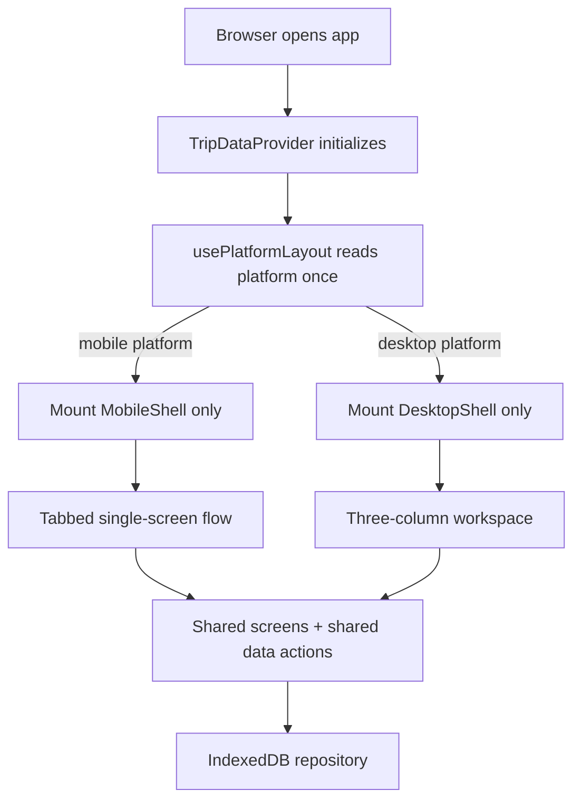
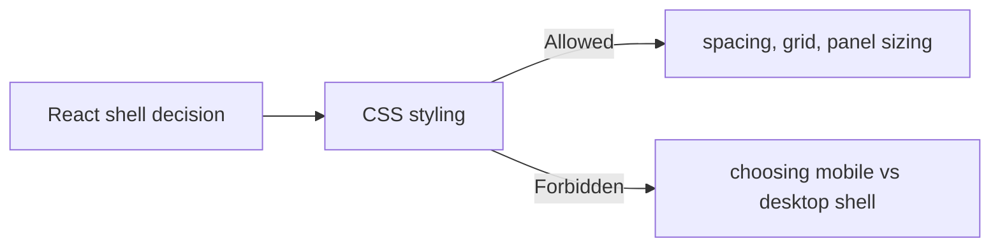
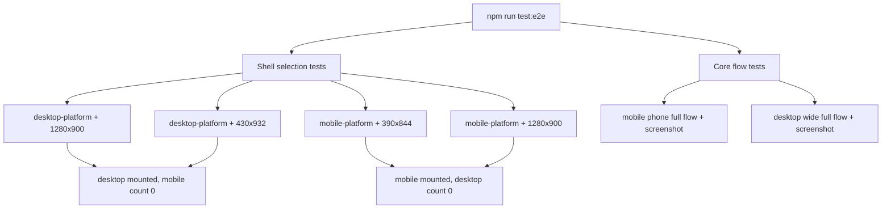

# Travel Split Platform Layout Implementation Plan - Senior Engineering Exit Review

## Context

Review target: revised platform-layout plan in `PLAN-platform-layout-implementation-plan.md`.

Selected product rule:

- Mobile browser platform renders the mobile tabbed layout.
- Non-mobile browser platform renders the desktop three-column workspace.
- Viewport width must not choose the shell.
- Runtime UI testing should cover multiple platform/viewport scenarios.
- Implementation should follow TDD red/green.

Relevant nearby code reviewed:

- `src/App.tsx`
- `src/ui/usePlatformLayout.ts`
- `src/ui/usePlatformLayout.test.ts`
- `e2e/travel-split.spec.ts`
- `playwright.config.ts`
- `src/index.css`

Important current-state observation: the plan is directionally right, but the current code still has a CSS breakpoint risk: `.desktop-app-shell { display: none; }` is only set to `display: block` inside `@media (min-width: 980px)`. If a desktop platform is narrowed below 980px, React may render the desktop shell but CSS will hide it. That directly violates the plan.

## Selected Scope Lens

**Big-change review** — full review of platform detection, shell architecture, desktop/mobile rendering, and runtime validation strategy.

## Scope Challenge

### What already exists?

- `TripDataProvider` already wraps the app and can remain above shell selection.
- Mobile shell exists in `App.tsx` with `NavBar`, `TabBar`, and one active screen.
- Desktop shell exists in `App.tsx` with header and three-column workspace.
- Shared screens already exist and are used by both shells: `PeopleScreen`, `ExpensesScreen`, `SettleScreen`.
- A pure detector exists: `isMobileBrowserPlatform()`.
- Unit tests exist for detector behavior.
- Playwright exists, but current `playwright.config.ts` has only one desktop Chromium project.
- Current E2E tests are not yet the matrix described by the revised plan.

### Minimum viable change

Even under a big-change lens, the smallest safe version should remain:

1. One pure detector.
2. One hook wrapper.
3. One rendered shell at a time.
4. Shared screens and data provider.
5. Playwright matrix that separates platform from viewport.
6. CSS must style the selected shell at any viewport; CSS must not hide the selected shell due to width.

### Complexity smell

The plan correctly avoids layout services, persisted overrides, tablet modes, and server detection. Keep avoiding those. The only complexity that is justified is the runtime test matrix, because platform-vs-viewport behavior is easy to regress without browser-level tests.

## Reviewed Implementation Target

Approved target after guardrails:

CSS contract:

The detector can decide shell. CSS can style shell. CSS must not override the shell decision.

## What Already Exists

| Area | Existing state | Review disposition |
|---|---|---|
| Platform detector | `src/ui/usePlatformLayout.ts` checks `userAgentData.mobile`, then UA regex | Keep. Add caveat comment and tests remain. |
| Shell render branch | `App.tsx` currently branches on `layout` | Keep. Consider extracting shells only after final matrix passes. |
| Desktop CSS | `desktop-app-shell` is hidden by default and shown only in `@media (min-width: 980px)` | Must change. This violates platform-not-viewport behavior. |
| Playwright config | One `chromium` desktop project | Must expand or create per-test contexts. Projects preferred. |
| Mobile E2E | Uses viewport only | Must change to mobile emulation. |
| Desktop E2E | Wide viewport only | Must add narrow desktop scenario. |
| Screenshots | Mobile and desktop screenshot paths exist | Keep, with deterministic synthetic test data. |

## Architecture Review

### Issue A1 — CSS still participates in shell selection

**Problem:** `src/index.css` hides `.desktop-app-shell` by default and only displays it inside `@media (min-width: 980px)`. Under the selected rule, a desktop browser at 430px must still render desktop. Current CSS can make the selected desktop shell invisible.

**Recommendation:** Remove CSS display selection. If React renders `data-layout="desktop"`, `.desktop-app-shell` must be displayable at every viewport. Use media queries only to adjust desktop grid overflow/scale, not to hide the shell.

**Options:**

1. **Preferred:** `.desktop-app-shell { display: block; ... }` always; desktop-specific sizing can degrade horizontally or use min-width/overflow.
2. Keep breakpoint display and weaken requirement to responsive layout.
3. Render mobile fallback if desktop viewport is narrow.

**Tradeoffs:** Preferred exactly matches platform rule. Option 2 is better general UX but contradicts product decision. Option 3 reintroduces viewport selection.

**Preference mapping:** Explicit behavior, correct runtime tests, no hidden DOM surprises.

### Issue A2 — Runtime tests must be platform projects, not viewport tests

**Problem:** The revised plan states this, but current `playwright.config.ts` has one `Desktop Chrome` project and `e2e/travel-split.spec.ts` uses `setViewportSize()` for the mobile flow. That does not emulate mobile platform and can produce false confidence.

**Recommendation:** Add Playwright projects or test contexts for `desktop-wide`, `desktop-narrow`, `mobile-phone`, and `mobile-wide`. Use `devices['iPhone 15']` or equivalent for mobile project baseline, then override viewport for mobile-wide.

**Options:**

1. **Preferred:** Playwright projects with clear names and metadata.
2. Per-test contexts with explicit `userAgent`, `isMobile`, `hasTouch`, and viewport.
3. Keep one project and viewport-only tests.

**Tradeoffs:** Projects make CI output self-documenting. Per-test contexts are flexible but more boilerplate. Viewport-only is insufficient.

**Preference mapping:** Relevant tests and explicit failure diagnostics.

### Issue A3 — Data isolation is currently underspecified for matrix tests

**Problem:** The plan mentions reset/isolation, but current tests do not reliably isolate IndexedDB across scenarios. Earlier failures showed state contamination can produce misleading settlement amounts.

**Recommendation:** Use Playwright's fresh context per test plus deterministic IndexedDB reset before first app action. Prefer helper `resetTravelSplitDb(page)` that deletes `travel-split`, reloads, and waits for selected shell.

**Options:**

1. **Preferred:** Reset DB helper in each full-flow test and shell-selection test where needed.
2. Depend on Playwright context isolation only.
3. Share state across tests intentionally.

**Tradeoffs:** Reset helper is explicit and stable. Context isolation is usually enough but can be defeated by server reuse or persistent context changes later. Shared state is flaky.

**Preference mapping:** Determinism and edge-case handling.

### Issue A4 — Platform detector should remain layout-only, not product logic

**Problem:** User-agent detection is inherently unreliable. It is acceptable for choosing a local UI shell, but dangerous if reused for business logic, persistence, or permissions.

**Recommendation:** Document in `usePlatformLayout.ts`: this detector is for presentation shell only and must not drive data/security decisions.

**Options:**

1. **Preferred:** Add a short code comment near `isMobileBrowserPlatform()`.
2. Create a more generic platform service.
3. Leave caveat only in plan.

**Tradeoffs:** Code comment prevents misuse near the function. Service is overkill. Plan-only warnings get stale.

**Preference mapping:** Explicitness and future maintainability.

### Issue A5 — Initial-render-only behavior creates state stability but needs acceptance

**Problem:** `usePlatformLayout()` uses `useMemo(..., [])`, so shell choice does not change during session. That matches the revised plan, but it can surprise developers during browser-device emulation toggles or hot reload.

**Recommendation:** Keep initial-only for v1 and test initial navigation only. Do not add resize listeners.

**Options:**

1. **Preferred:** Initial-only platform decision.
2. Recompute on resize/orientation.
3. Recompute on every render.

**Tradeoffs:** Initial-only avoids remounting screens and losing focus/state. Resize recompute is complex and would contradict platform-stable shell selection. Every-render is unnecessary.

**Preference mapping:** Low state risk and maintainable behavior.

## Code Quality Review

### Issue C1 — Shell rendering should be named, not embedded indefinitely

**Problem:** `App.tsx` currently contains `TravelSplitShell` and `DesktopHeader`. This is acceptable now, but adding matrix-tested platform behavior and desktop-specific header copy can make `App.tsx` a layout grab bag.

**Recommendation:** For implementation, either keep local functions under 200 lines or extract `MobileShell` and `DesktopShell` into small components once tests pass. Do not extract before tests unless it clarifies code.

**Options:**

1. **Preferred:** Keep now; extract only if `App.tsx` grows further.
2. Extract immediately into `src/layout/MobileShell.tsx` and `DesktopShell.tsx`.
3. Introduce a full layout framework.

**Tradeoffs:** Keeping local minimizes churn. Extraction improves clarity if the file grows. Layout framework is overengineering.

**Preference mapping:** Minimal diff and readable ownership.

### Issue C2 — CSS names still imply responsive breakpoint ownership

**Problem:** Classes like `mobile-app-shell` and `desktop-app-shell` are fine, but CSS media queries currently decide their visibility. That makes CSS ownership ambiguous.

**Recommendation:** Rename comments and CSS organization to make the ownership clear: React selects shell; CSS styles shell. Remove `.mobile-app-shell { display:none }` and `.desktop-app-shell { display:none }` patterns unless they are behind selected-shell-only rendering.

**Options:**

1. **Preferred:** CSS always styles mounted shell; no shell-selection display rules.
2. Keep display rules for visual safety.
3. Add CSS assertions in tests only.

**Tradeoffs:** Preferred prevents hidden-selected-shell bugs. Display rules may hide broken branching. Tests alone cannot make CSS ownership clear.

**Preference mapping:** Explicit behavior and lower debugging burden.

### Issue C3 — Test helpers need scenario names that encode platform and viewport

**Problem:** Test names like `mobile core local trip flow` do not prove whether the browser is mobile-emulated or merely narrow.

**Recommendation:** Name tests/projects with both platform and viewport: `mobile-platform-phone-viewport`, `desktop-platform-narrow-viewport`.

**Options:**

1. **Preferred:** Project names plus concise test names.
2. Long test names only.
3. Comments in tests.

**Tradeoffs:** Project names show up in Playwright output and artifacts. Long test names help but can be noisy. Comments are easy to miss.

**Preference mapping:** Clear diagnostics and maintainable validation.

### Issue C4 — Unit tests should not assert viewport behavior directly

**Problem:** `isMobileBrowserPlatform()` cannot see viewport. A unit test named "desktop browser at narrow viewport" is misleading unless it only asserts UA behavior.

**Recommendation:** Keep viewport assertions in Playwright. Unit tests should say "desktop UA returns desktop" rather than imply window sizing.

**Options:**

1. **Preferred:** Pure detector unit tests for UA/client-hint branches; Playwright for platform+viewport matrix.
2. Mock `window.innerWidth` in unit tests.
3. Move all tests to Playwright.

**Tradeoffs:** Preferred keeps unit tests honest. Mocking width suggests detector should use width. All-Playwright slows feedback.

**Preference mapping:** Relevant test level and explicit behavior.

## Validation Requirement

### Required runtime test matrix

### Coverage matrix

| Behavior | Validation | Level | Protects against | Untested after plan |
|---|---|---|---|---|
| Client Hints mobile true | `usePlatformLayout.test.ts` | Unit | `userAgentData.mobile` ignored | Actual browser CH support quirks |
| Client Hints mobile false | `usePlatformLayout.test.ts` | Unit | UA fallback overriding CH | None critical |
| iPhone UA fallback | Unit + mobile Playwright project | Unit/E2E | non-CH mobile browsers show desktop | iPad desktop mode ambiguity |
| Desktop wide | Playwright desktop-wide | E2E | desktop shell broken at normal width | Visual pixel drift |
| Desktop narrow | Playwright desktop-narrow | E2E | CSS breakpoint hiding selected desktop shell | Usability at narrow desktop width |
| Mobile phone | Playwright mobile-phone | E2E | mobile shell not selected on real mobile emulation | Safari-specific differences unless WebKit added |
| Mobile wide | Playwright mobile-wide | E2E | CSS breakpoint overriding mobile shell | Tablet UA ambiguity |
| Non-selected shell absent | Playwright assertions | E2E/accessibility | duplicate labels/IDs | Hidden portals/modals if added later |
| Full mobile flow | Playwright | E2E | tab navigation, persistence, settlement | Complete visual regression |
| Full desktop flow | Playwright | E2E | three-panel shared state update | Complete visual regression |

### Validation gaps identified

1. `playwright.config.ts` has one desktop project; it does not encode the required matrix.
2. `e2e/travel-split.spec.ts` mobile flow uses viewport only; it is not mobile platform validation.
3. Current tests assert `toBeHidden()` for the opposite shell in at least one place; for single-branch rendering, use `toHaveCount(0)`.
4. Current desktop test can be contaminated by prior IndexedDB state; the plan must require deterministic DB reset per scenario.
5. Desktop-narrow and mobile-wide shell-selection tests do not exist yet.
6. The CSS breakpoint contradiction is not covered unless desktop-narrow is added.

## Performance and Risk Review

### Issue R1 — Single mounted shell is efficient, but CSS can still nullify it

**Problem:** React single-branch rendering avoids duplicate screens. But CSS display rules can still make the chosen branch invisible.

**Recommendation:** Remove shell-selection display from CSS and add desktop-narrow test before implementation is accepted.

**Options:**

1. **Preferred:** CSS neutralization + desktop-narrow test.
2. Rely on visual manual testing.
3. Keep CSS rule and document exception.

**Tradeoffs:** Preferred catches the actual risk. Manual testing is unreliable. Documenting exception contradicts plan.

### Issue R2 — Mobile emulation cost is acceptable

**Problem:** Adding four Playwright projects increases runtime time and artifacts.

**Recommendation:** Keep four shell-selection scenarios lightweight. Run full flow in only two scenarios.

**Options:**

1. **Preferred:** Four shell-only tests + two full-flow tests.
2. Full flow in all four projects.
3. Only two tests total.

**Tradeoffs:** Preferred balances confidence and speed. Full flow everywhere is slower and duplicates coverage. Two tests miss platform-vs-viewport regressions.

### Issue R3 — UA detection is not security-sensitive but should not spread

**Problem:** Platform detection can be spoofed or wrong. If other modules start using it, bugs can grow beyond layout.

**Recommendation:** Keep detector in `src/ui`, not `src/domain`, and document presentation-only usage.

**Options:**

1. **Preferred:** UI-only detector.
2. Move to domain/shared platform module.
3. Inline detector in App.

**Tradeoffs:** UI-only keeps scope clear. Domain/shared invites misuse. Inline hides testable logic.

### Issue R4 — Screenshots need deterministic synthetic state

**Problem:** If screenshots use existing local IndexedDB data, artifacts may leak user data or flake.

**Recommendation:** Reset IndexedDB before screenshot flows and use synthetic names/amounts only.

**Options:**

1. **Preferred:** DB reset helper + synthetic test data.
2. Use current browser state.
3. Disable screenshots.

**Tradeoffs:** Preferred is deterministic. Current state is risky. No screenshots conflicts with requested runtime UI proof.

### Issue R5 — Narrow desktop usability is an accepted tradeoff, but not invisible UI

**Problem:** If desktop shell is forced on a 430px desktop viewport, it may need horizontal scrolling or compressed grid. That is acceptable under the product rule; invisible UI is not.

**Recommendation:** For desktop-narrow, assert shell is visible and key panels are reachable. Do not require perfect narrow desktop design in v1.

**Options:**

1. **Preferred:** Accept horizontal overflow/stacking polish later, require visibility now.
2. Make desktop-narrow use mobile shell.
3. Design a special narrow-desktop layout now.

**Tradeoffs:** Preferred honors the selected rule. Option 2 violates it. Option 3 is extra scope.

## Failure Modes

| Codepath | Realistic failure mode | Test covers it? | Error handling exists? | User/operator feedback | Critical gap? |
|---|---|---:|---:|---|---:|
| React shell branch | Both shells mounted and labels collide | Planned `toHaveCount(0)` assertions | N/A | Test failure; otherwise a11y/locator issues | No if added |
| CSS shell styling | Desktop shell selected on narrow desktop but hidden by media query | Not yet; needs desktop-narrow E2E | No | Blank/invisible UI | **Yes** |
| Mobile platform detection | Mobile emulation still renders desktop because test only changed viewport | Not yet; needs real mobile project/context | No | Wrong UX on mobile | **Yes** |
| Mobile-wide platform | Mobile UA at wide viewport renders desktop due to CSS breakpoint | Not yet; needs mobile-wide E2E | No | Wrong UX on tablets/mobile display modes | **Yes until test exists** |
| IndexedDB test state | Desktop flow sees prior mobile test data and expected settlement changes | Partially surfaced by current failures | Reset helper planned | Test flake/wrong assertion | No if reset added |
| UA ambiguity | iPad desktop mode classified as desktop | Unit tests cannot fully cover | Documented caveat | User gets desktop on iPad | No, accepted tradeoff |
| Copy summary desktop | Clipboard denied in desktop header | Existing try/catch | Yes, status text | Visible "Copy failed" | No |

## NOT In Scope

- Responsive shell selection by breakpoint.
- Layout preference toggle.
- Persisted layout override.
- Tablet-specific shell.
- Server/device detection service.
- Native app/device testing.
- Visual regression baseline suite.
- Rewriting People/Expenses/Settle screens.
- Moving platform logic into domain layer.

## TODO Follow-Ups Proposed

1. **What:** Add layout override only after real misclassification reports.
   **Why:** UA/platform detection is ambiguous for iPadOS and unusual browsers.
   **Context:** Current v1 intentionally follows platform detection without user setting.
   **Depends on / blocked by:** Evidence from users or QA that platform detection is wrong enough to matter.

2. **What:** Evaluate tablet-specific workspace behavior.
   **Why:** Mobile platform on large tablets may benefit from desktop workspace even though current rule says mobile.
   **Context:** Current plan deliberately treats mobile platform as mobile regardless of viewport.
   **Depends on / blocked by:** Product decision to split phone vs tablet.

3. **What:** Add visual diff snapshots after layout stabilizes.
   **Why:** Current screenshots are runtime evidence, not regression baselines.
   **Context:** Desktop and mobile designs are still changing quickly.
   **Depends on / blocked by:** Stable visual approval and artifact retention policy.

4. **What:** Consider WebKit mobile runtime smoke later.
   **Why:** iOS Safari behavior may differ from Chromium mobile emulation.
   **Context:** Current Playwright Chromium is enough for first browser-runtime proof.
   **Depends on / blocked by:** Need for broader browser support validation.

Ask before creating or editing `TODOS.md`.

## Unresolved Decisions

1. Should desktop-narrow be visibly cramped but desktop, or should it use a desktop-specific stacked layout? Recommendation: visible desktop now; polish later.
2. Should mobile-wide represent tablets? Recommendation: yes for testing the stated rule, but do not claim tablet UX is final.
3. Should Playwright projects include WebKit? Recommendation: not required for this pass, but valuable later.
4. Should `navigator.userAgentData.mobile=false` always override mobile-looking UA? Recommendation: yes; Client Hints are the primary source by contract.
5. Should layout selection be re-evaluated on hot reload/resize? Recommendation: no for user runtime; dev hot reload quirks are acceptable.

## Final Recommendation

**Approve with guardrails.**

The revised plan is implementation-ready only if the following are added before claiming done:

1. Remove CSS breakpoint shell selection, especially `.desktop-app-shell { display: none; }` outside desktop media queries.
2. Add Playwright platform/viewport matrix using real mobile emulation.
3. Use `toHaveCount(0)` to prove the non-selected shell is not mounted.
4. Reset or isolate IndexedDB per runtime scenario.
5. Keep platform detector documented as UI-only/presentation-only.

Do not add layout toggles, tablet-specific shells, or services yet.

## Completion Summary

- Step 0: Scope Challenge (user chose: Big-change review)
- Architecture Review: 5 issues found
- Code Quality Review: 4 issues found
- Validation Requirement: diagram produced, 6 gaps identified
- Performance and Risk Review: 5 issues found
- NOT in scope: written
- What already exists: written
- TODO follow-ups: 4 items proposed
- Failure modes: 3 critical gaps flagged
- Unresolved decisions: 5
