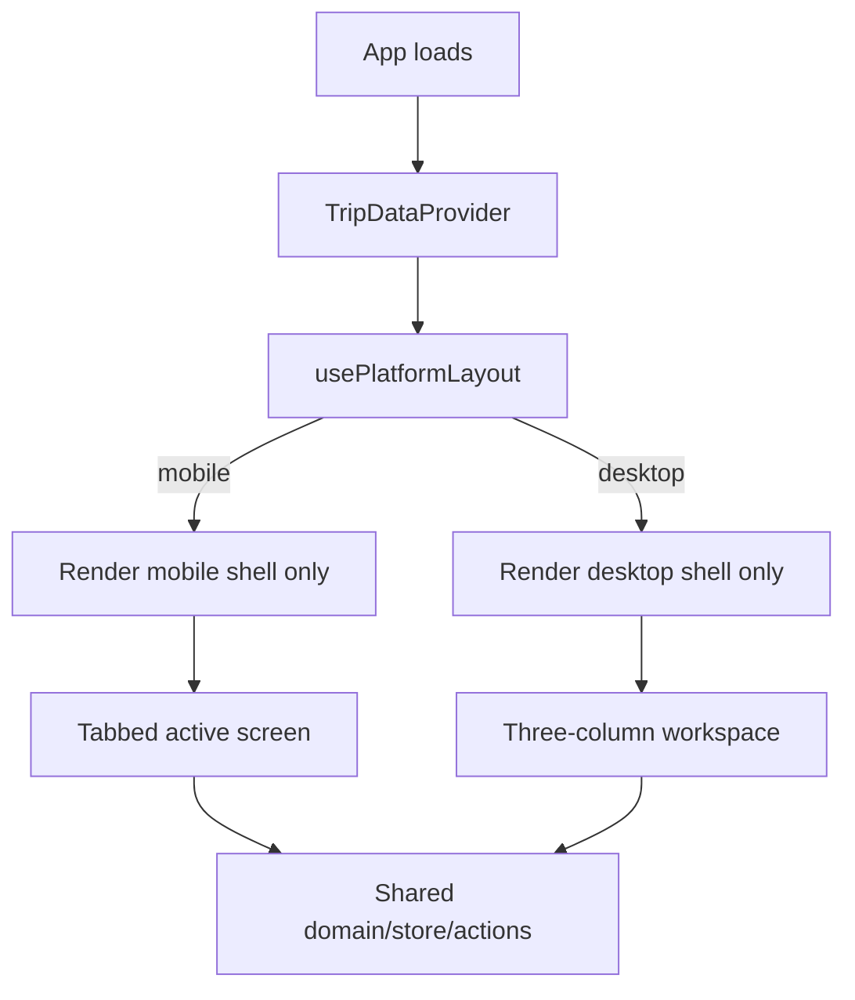

# Travel Split Platform Layout Implementation Plan

## Decision

Use browser platform detection to choose the app shell:

- **Mobile browser platform** → render the mobile tabbed layout.
- **Non-mobile browser platform** → render the desktop three-column workspace.

This is intentionally **not viewport-based**. A desktop browser narrowed to phone width still renders desktop. A mobile browser with a wide viewport still renders mobile.

## Reduced Scope

Implement only the smallest safe version:

1. One pure detector: `isMobileBrowserPlatform()`.
2. One thin hook: `usePlatformLayout()`.
3. `App.tsx` renders exactly one shell:
   - mobile shell, or
   - desktop shell.
4. Shared screens stay shared:
   - `PeopleScreen`
   - `ExpensesScreen`
   - `SettleScreen`
5. Runtime tests must prove platform behavior, not just responsive CSS behavior.

Do **not** add:

- layout preference toggle,
- persisted override,
- tablet-specific shell,
- server-side detection,
- layout service/context,
- CSS breakpoint-based shell selection.

## Platform Detector Contract

Detection order:

1. Prefer `navigator.userAgentData.mobile` when available.
2. Fallback to mobile user-agent regex.
3. Default to desktop when no browser navigator exists.

Known limitation: iPadOS desktop mode and unusual browsers may be ambiguous. This is acceptable for v1 because the detector only controls local UI layout, not security or data access.

## App Rendering Contract



Requirements:

- The non-selected shell must not be mounted in the DOM.
- No duplicate labels/IDs between mobile and desktop.
- Layout choice is evaluated on initial render only.
- Resize/orientation changes do not switch shells in v1.

## TDD Red/Green Plan

### Red 1 — Unit detector tests

Add/confirm tests for:

- `userAgentData.mobile === true` returns mobile.
- `userAgentData.mobile === false` returns desktop, even if UA text contains `Mobile`.
- iPhone UA fallback returns mobile.
- desktop UA at narrow viewport still returns desktop.

### Green 1 — Detector implementation

Implement/keep:

- `src/ui/usePlatformLayout.ts`
- `isMobileBrowserPlatform()` pure function
- `usePlatformLayout()` hook wrapper

### Red 2 — Runtime shell-selection matrix

Add Playwright projects or contexts for:

| Scenario | Platform | Viewport | Expected shell |
|---|---|---:|---|
| desktop-wide | desktop Chrome | 1280×900 | desktop |
| desktop-narrow | desktop Chrome | 430×932 | desktop |
| mobile-phone | mobile emulation | 390×844 | mobile |
| mobile-wide | mobile emulation | 1280×900 | mobile |

Assertions:

- selected shell is visible,
- non-selected shell is not mounted / not found,
- mobile shell has tablist,
- desktop shell has no tablist and shows all three panels.

### Green 2 — App shell rendering

Update `App.tsx` so it renders only one branch:

```tsx
const layout = usePlatformLayout();
return layout === 'mobile' ? <MobileShell /> : <DesktopShell />;
```

### Red 3 — Runtime core flows

Run full user flow in two representative scenarios:

1. mobile-phone:
   - add Alex,
   - add Mina,
   - add Dinner $40 paid by Alex,
   - settle shows Mina → Alex $20,
   - reload persists.

2. desktop-wide:
   - all three panels visible at once,
   - add Alex,
   - add Mina,
   - add Dinner $40 paid by Alex,
   - settlement updates in desktop panel,
   - screenshot saved.

### Green 3 — Runtime stabilization

Ensure tests reset or isolate IndexedDB between scenarios so one test cannot contaminate another.

Preferred: Playwright fresh context per test plus deterministic first-load state. If needed, delete IndexedDB before each scenario and wait for app reload.

## Playwright Runtime Test Requirements

Minimum artifacts:

- `artifacts/runtime-validation.png` — mobile flow screenshot.
- `artifacts/desktop-workspace-validation.png` — desktop flow screenshot.

Required assertions:

```ts
await expect(page.locator('[data-layout="mobile"]')).toBeVisible();
await expect(page.locator('[data-layout="desktop"]')).toHaveCount(0);
```

and:

```ts
await expect(page.locator('[data-layout="desktop"]')).toBeVisible();
await expect(page.locator('[data-layout="mobile"]')).toHaveCount(0);
```

Use real mobile emulation for mobile scenarios; do not rely on `setViewportSize()` alone.

## Acceptance Gate

Run:

```bash
npm test
npm run build
npm run test:e2e
```

Then run full gate:

```bash
npm run verify
```

Acceptance criteria:

- Unit detector tests pass.
- Existing domain/store tests pass.
- Build passes.
- Playwright shell-selection matrix passes.
- Full mobile and desktop runtime flows pass.
- Screenshots exist for mobile and desktop.

## Deferred Follow-ups

1. **Layout override** — add only if real users hit iPad/tablet misclassification.
2. **Tablet-specific layout** — decide later if tablets should use desktop workspace despite mobile platform.
3. **Visual regression snapshots** — add only after desktop/mobile designs stabilize.
