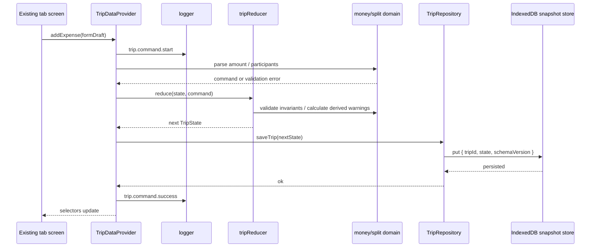
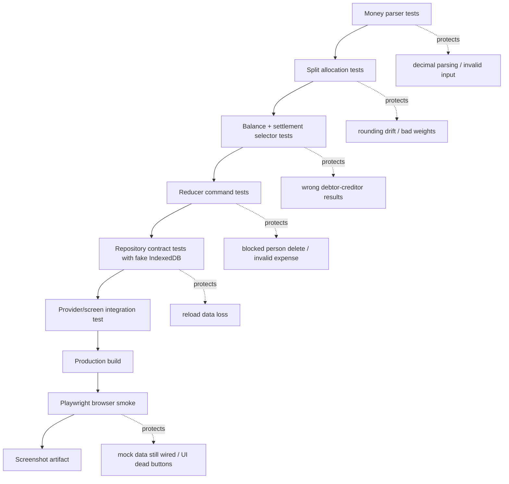

# Travel Split Local Data Flow Plan - Senior Engineering Exit Review

## Context

Review target: implement Travel Split's logic, data flow, and data store after reviewing the existing Tailwind front-end layout and implementation plan.

Current observed state:

- Existing app is React + Vite + TypeScript + Tailwind with a tabbed shell in `src/App.tsx`.
- `npm run build` passes.
- `PeopleScreen`, `ExpensesScreen`, and `SettleScreen` render static `MOCK_*` data and local-only form state.
- `package.json` has no test, coverage, or e2e scripts yet.
- Original plan/spec explicitly define Phase 1 as browser-only, single-device, local-first, no backend/accounts/cloud sync/payment/native app.
- Original plan/spec specify localStorage, but the latest explicit user decision is: **IndexedDB now, SQLite later**, using a tiny `idb` wrapper, with current tabs preserved and console-only structured logs.

Reviewed artifacts:

- `/Users/crossianllc/Downloads/2026-05-15-travel-split-plans.md`
- `/Users/crossianllc/Downloads/2026-05-15-travel-split-specs.md`
- `/Users/crossianllc/Downloads/travel-split/PLAN-travel-split-implementation-contract.md`
- `/Users/crossianllc/Downloads/travel-split/src/App.tsx`
- `/Users/crossianllc/Downloads/travel-split/src/screens/PeopleScreen.tsx`
- `/Users/crossianllc/Downloads/travel-split/src/screens/ExpensesScreen.tsx`
- `/Users/crossianllc/Downloads/travel-split/src/screens/SettleScreen.tsx`
- `/Users/crossianllc/Downloads/travel-split/src/data/mock.ts`

## Selected Scope Lens

**Scope reduction** — challenge the plan and propose the smallest safe implementation that still satisfies local persistence, testability, and runtime validation.

## Scope Challenge

### What already exists?

- **UI shell exists:** `App.tsx` already owns tab selection and renders People / Expenses / Settle screens.
- **Screen layout exists:** the Tailwind UI already includes add-person input, expense form, advanced split disclosure, settlement rows, and copy affordance location.
- **Formatting helper exists:** `formatCents` / `formatCentsAbs` exist in `src/data/mock.ts` but should move into domain/presentation utilities.
- **Design-preview logic exists:** People screen has empty/populated toggles. This should be removed or converted into real empty-state behavior.
- **No real data layer exists:** no reducer, no repository, no persistence adapter, no tests, no browser runtime automation.

### Minimum viable change

Smallest safe target:

1. Preserve current tabbed layout.
2. Add pure domain modules for money, split allocation, balances, settlements, and validation.
3. Add `TripDataProvider` with command methods and selectors.
4. Add a `TripRepository` interface.
5. Implement **one active-trip snapshot in IndexedDB**, keyed by `tripId`, instead of fully normalized `people` and `expenses` stores in the first pass.
6. Keep `tripId` inside `TripState` so a future SQLite adapter or normalized IndexedDB migration remains straightforward.
7. Replace `MOCK_*` imports with provider data.
8. Add Vitest coverage and one Playwright browser smoke/screenshot path.

This reduced target still satisfies: browser-only, local database, SQLite-later seam, TDD, logging, and runtime validation. It avoids prematurely building a mini relational database in IndexedDB before there is a second database implementation or multiple-trip requirement.

### Complexity smell

The deck-selected plan can easily touch 12–18 files and introduce provider, reducer, repository, database schema, migrations, fake IndexedDB setup, Playwright, logger, domain types, form parsers, selectors, and UI rewiring in one pass. That is too much for the first green implementation.

Reduce the storage design first. A snapshot-in-IndexedDB repository is enough. Normalize later only when either multiple trips, querying, import/export, or SQLite migration work begins.

## Recommended Implementation Target

Implement the reduced version below.

### Target architecture



### Storage shape for first implementation

```ts
export interface TripRepository {
  loadActiveTrip(): Promise<TripState | null>;
  saveTrip(trip: TripState): Promise<void>;
  resetTrip(tripId: string): Promise<void>;
}

// IndexedDB v1
// stores:
// - metadata: { key: "activeTripId", value: string }
// - tripSnapshots: { tripId: string, schemaVersion: 1, state: unknown, updatedAt: string }
```

This is intentionally not fully normalized. It is still a local database, still has a repository seam, and still has `tripId` for future migration.

## What Already Exists

| Area | Existing implementation | Reuse or replace |
|---|---|---|
| App shell | `App.tsx` tab state + `NavBar` + `TabBar` | Reuse. Wrap contents in `TripDataProvider`. |
| People UI | Add input, list, blocked remove copy, design toggles | Reuse layout. Remove design toggles. Wire add/remove to provider. |
| Expenses UI | Title, amount, payer, advanced disclosure, list rows | Reuse layout. Replace mock options/list with provider data. |
| Settlement UI | Balance rows, expandable receipt card | Reuse layout. Replace mock balances/settlements with selectors. |
| Mock data | `src/data/mock.ts` | Keep only as seed/demo test fixture if needed; do not import in production screens. |
| Money formatting | `formatCents`, `formatCentsAbs` | Move to domain/presentation utility and test. |
| Tests | None | Add Vitest, coverage, repository tests, Playwright smoke. |
| Persistence | None | Add IndexedDB repository. |

## Architecture Review

### Issue A1 — The written implementation contract is stale and internally contradictory

**Problem:** `PLAN-travel-split-implementation-contract.md` still says localStorage and sticky workspace, while the latest decisions say IndexedDB and preserve tabs. If implementation starts from the stale file, the team may build the wrong storage and layout.

**Recommendation:** Do not code until the plan target is reconciled in a short addendum or replacement section. The implementation contract should state: current tabs preserved, IndexedDB snapshot repository v1, SQLite-later seam, console logging, Vitest + Playwright.

**Options:**

1. **Preferred:** Add an "Implementation Addendum — 2026-05-19" section that supersedes localStorage/workspace sections.
2. Rewrite the whole contract file.
3. Do nothing and rely on conversation history.

**Tradeoffs:** Addendum is minimal and explicit. Rewrite is cleaner but higher churn. Doing nothing creates avoidable implementation ambiguity.

**Preference mapping:** Explicit behavior, minimal diff, fewer stale diagrams/plans.

### Issue A2 — Fully normalized IndexedDB is overbuilt for this pass

**Problem:** Normalized `trips`, `people`, and `expenses` stores plus internal trip IDs add migration/query complexity before there is multiple-trip UI or SQLite implementation. IndexedDB transactions and validation will dominate the first implementation.

**Recommendation:** Use a `TripRepository` interface with a single snapshot store in IndexedDB v1. Keep `tripId` in `TripState`; defer normalized stores to SQLite or a v2 IndexedDB migration.

**Options:**

1. **Preferred:** Snapshot-in-IndexedDB with `metadata` + `tripSnapshots` stores.
2. Fully normalized IndexedDB stores now.
3. Revert to localStorage from the original plan.

**Tradeoffs:** Snapshot is lowest risk and enough for MVP. Normalized stores help future queries but slow the first green path. localStorage matches original docs but violates the newest data-store decision.

**Preference mapping:** Minimal diff, edge-case containment, SQLite-later without premature abstraction.

### Issue A3 — Provider must define persistence failure semantics

**Problem:** The plan says provider runs reducer then repository effects, but does not say what users see if IndexedDB save fails. Updating React state before a failed save creates a false success that disappears on reload.

**Recommendation:** For v1, persist before committing UI state for mutating commands. On failure, keep previous state, show an inline error, and log `trip.command.failed`.

**Options:**

1. **Preferred:** Persist-first commit for commands, with visible error.
2. Optimistic update with rollback on failed save.
3. Optimistic update with console-only failure.

**Tradeoffs:** Persist-first can feel slightly slower but is simple and truthful. Rollback is more code. Console-only failure is silent data loss.

**Preference mapping:** Explicit error handling, fewer state races.

### Issue A4 — New dependency count needs a health check and a hard boundary

**Problem:** The selected plan likely adds `idb`, Vitest coverage tooling, React Testing Library/jsdom or happy-dom, fake IndexedDB, and Playwright. Original plan says new dependencies require reason and health check.

**Recommendation:** Approve only the minimum set for this pass: `idb`, Vitest coverage tooling, one DOM test environment, one IndexedDB test shim, and Playwright. Document why each exists in the plan addendum or PR notes.

**Options:**

1. **Preferred:** Add minimum test/runtime dependencies with a quick health check.
2. Avoid Playwright and do manual screenshot validation.
3. Avoid IndexedDB shim and test repository only manually.

**Tradeoffs:** Minimum dependencies satisfy requirements. Manual runtime evidence is less repeatable. Untested storage is not acceptable for a data-layer change.

**Preference mapping:** Relevant tests, dependency discipline.

### Issue A5 — Copy/share behavior must move from decorative button to data-backed action

**Problem:** `NavBar showCopy={activeTab === 'settle'}` only controls visibility. The plan requires copy settlement summary, but no data-backed handler is specified.

**Recommendation:** Add `copySettlementSummary()` or `getShareSummary()` from provider/selectors and pass it to `NavBar`. Cover success/failure copy paths lightly.

**Options:**

1. **Preferred:** Provider exposes summary text; `NavBar` calls clipboard API and shows status.
2. Settle screen owns copy button instead of `NavBar`.
3. Leave copy as decorative for v1.

**Tradeoffs:** Provider summary keeps formatting centralized. Settle-owned copy is simpler visually but duplicates nav intent. Decorative copy violates acceptance.

**Preference mapping:** Explicit behavior and user-facing completion.

## Code Quality Review

### Issue C1 — Domain types should replace mock DTOs, not extend them

**Problem:** `src/data/mock.ts` has `Expense.paidBy: string`, `peopleCount`, and `isWeighted`, which are display artifacts. Real split math needs `payerId`, `participants: { personId, weight }[]`, and `amountCents`.

**Recommendation:** Create `src/domain/types.ts` and migrate screens to real domain DTOs. Keep mock data only as tests/demo fixtures if needed.

**Options:**

1. **Preferred:** Introduce clean domain types and map them to screen props/selectors.
2. Mutate mock types to become domain types.
3. Keep mock types and bolt on fields.

**Tradeoffs:** Clean types reduce confusion. Mutating mock types is quick but leaves display concerns in domain. Bolting on fields causes drift.

**Preference mapping:** DRY and explicit model ownership.

### Issue C2 — Form parsing should not live inline in screen components

**Problem:** The expense screen currently stores raw strings. If parse/validation logic is added inline, tests become UI-heavy and edge cases spread across components.

**Recommendation:** Add form boundary helpers such as `parseAmountToCents`, `buildExpenseDraft`, and `validateParticipants`. Screen components should only call provider commands and display errors.

**Options:**

1. **Preferred:** Parser helpers under `src/domain` or `src/forms` with unit tests.
2. Provider parses all raw input directly.
3. Components parse and validate inline.

**Tradeoffs:** Helpers are testable and small. Provider-only parsing can become a God object. Inline parsing is fastest but brittle.

**Preference mapping:** Relevant tests and maintainable design.

### Issue C3 — TripDataProvider can become a God module

**Problem:** Provider will want to own load state, commands, persistence, logging, selectors, errors, and copy summary. Without boundaries, one file will exceed the project preference for small files and be hard to test.

**Recommendation:** Split into small modules: provider shell, reducer, selectors, repository, logger, and form parsers. Keep provider mostly orchestration.

**Options:**

1. **Preferred:** Small files with clear ownership.
2. One provider module for first pass, refactor later.
3. External state library.

**Tradeoffs:** Small modules add files but keep tests focused. One file is quick but accumulates debt. External store is unnecessary dependency.

**Preference mapping:** Maintainability and explicit ownership.

### Issue C4 — Structured logs need a schema and redaction rule

**Problem:** "Console-only structured logs" is selected, but without a wrapper, raw console calls will be inconsistent and may dump full trip data or screenshots-visible names/amounts during tests.

**Recommendation:** Add `src/logging/logger.ts` with event name, level, and safe metadata. Do not log full trip state by default.

**Options:**

1. **Preferred:** Logger wrapper with safe event payloads.
2. Raw `console.info/warn/error` where needed.
3. Persistent local audit logs.

**Tradeoffs:** Wrapper is small and test-spyable. Raw console is inconsistent. Persistent logs were explicitly not selected.

**Preference mapping:** Debuggability without privacy creep.

## Validation Requirement

### Validation diagram



### Coverage matrix

| Item | Validation | Level | Protects against | Untested after reduced target |
|---|---|---|---|---|
| Amount parsing | `money.test.ts` | Unit | Floating point / malformed input | Locale-specific currency formatting beyond `$` |
| Equal + weighted allocation | `split.test.ts` | Unit | Rounding drift and non-reconciling shares | Multi-currency, intentionally out of scope |
| Invalid expenses | `validation.test.ts` or `split.test.ts` | Unit | Bad payer/participants breaking settlement | Complex import repair UI |
| Reducer commands | `tripReducer.test.ts` | Unit | Wrong add/remove/upsert/delete behavior | React rendering details |
| Provider command persistence | Provider integration test | Integration | State updated but not saved | Rare IndexedDB quota/browser bugs |
| IndexedDB snapshot load/save | Repository contract tests with fake IndexedDB | Integration | Reload loses data or bad shape crashes app | Native browser IndexedDB quirks beyond Playwright smoke |
| Current tabs wired to real data | React Testing Library or Playwright | Integration/E2E | Screens still use `MOCK_*` | Deep visual regression |
| Runtime browser flow | Playwright | E2E | Build works but UI flow fails | Full cross-browser matrix |
| Screenshot evidence | Playwright screenshot | Manual/evidence artifact | Claim without runtime proof | Exact pixel design approval |

### Validation gaps identified

1. **No test runner exists today.** Add scripts and config before coding domain logic.
2. **No coverage threshold exists.** Configure coverage at 80% for statements/branches/functions/lines, or state which dimensions apply.
3. **No fake IndexedDB test strategy is documented.** Add a test shim or repository fake before writing persistence code.
4. **No explicit persistence-failure test exists.** Add one test for repository save failure causing visible error and no false success.
5. **No runtime artifact path exists.** Define `artifacts/runtime-validation.png` or Playwright's default output path.

## Performance and Risk Review

### Issue R1 — IndexedDB availability and async boot can create a blank app

**Problem:** IndexedDB may fail in private browsing, restricted browser environments, or due to quota/corruption. Async boot can also flash the wrong empty state.

**Recommendation:** Add explicit `loading`, `ready`, and `error` states in provider. If load fails, show usable empty trip with a warning and log the failure.

**Options:**

1. **Preferred:** Ready/error state with visible warning.
2. Block app until DB loads forever.
3. Silently fallback to empty state.

**Tradeoffs:** Visible warning avoids silent data loss. Blocking is bad UX. Silent fallback is dangerous.

### Issue R2 — Snapshot writes are acceptable, but must be command-scoped

**Problem:** Saving the entire trip after every command is fine for MVP size, but avoid writing on every keystroke or render.

**Recommendation:** Save only after accepted commands, not raw form input changes.

**Options:**

1. **Preferred:** Command-scoped save.
2. Debounced autosave raw form state.
3. Persist on every state update.

**Tradeoffs:** Command-scoped is predictable. Debounced draft save is future work. Every render risks churn and bugs.

### Issue R3 — Local-only data loss risk needs one user-facing escape hatch

**Problem:** IndexedDB is local to one browser profile. Users can clear it or lose it. Original product permits copy/export summary.

**Recommendation:** Ensure copy/export summary is implemented before claiming persistence complete. Do not add cloud sync.

**Options:**

1. **Preferred:** Copy settlement/trip summary text.
2. JSON export/import.
3. Backend sync.

**Tradeoffs:** Summary copy is in-scope and low risk. JSON import/export is useful but deferrable. Backend sync is out of scope.

### Issue R4 — Playwright increases bootstrap risk

**Problem:** Playwright browser install can fail on fresh machines or CI if not scripted.

**Recommendation:** Add clear setup notes and use one Chromium smoke test only. Keep e2e small.

**Options:**

1. **Preferred:** One smoke test and documented `npx playwright install --with-deps chromium` if needed.
2. Full multi-browser suite.
3. Manual only.

**Tradeoffs:** One browser gives runtime proof with manageable setup. Multi-browser is overkill. Manual is not repeatable.

### Issue R5 — Logs and screenshots can leak trip details

**Problem:** Console logs and Playwright screenshots may include names and amounts.

**Recommendation:** Use deterministic test names/amounts and do not log full trip state. Keep artifacts local.

**Options:**

1. **Preferred:** Redacted structured logs + synthetic e2e data.
2. Log full state for easier debugging.
3. Disable logs in tests.

**Tradeoffs:** Redaction preserves debugging and privacy. Full state is easier but noisy. Disabling logs reduces coverage of logging behavior.

## Failure Modes

| Codepath | Realistic failure mode | Test covers it? | Error handling exists in plan? | User/operator feedback | Critical gap? |
|---|---|---:|---:|---|---:|
| Provider initial load | IndexedDB throws or unavailable | Proposed repository/provider test | Must add | Visible warning + console error | No, if implemented |
| Add person | Empty/duplicate-looking name accepted unexpectedly | Proposed reducer/parser test | Must add | Inline validation message | No, if implemented |
| Add expense | `40.005` or invalid amount creates bad cents | Proposed money tests | Must add | Inline amount error | No, if implemented |
| Weighted split | Remainder cents do not reconcile to original amount | Proposed split tests | Domain should enforce | Unit failure, no user error needed | No, if implemented |
| Save trip | Repository write fails after reducer success | Missing unless added | Not yet specified | Must show save error | **Yes until tested/handled** |
| Reload trip | Stored shape is corrupt | Proposed repository validation test | Must add | Empty trip + warning | No, if implemented |
| Delete person | Referenced person removed and expenses break | Proposed reducer test | UI shows disabled button but reducer must enforce | Inline/blocking message | No, if implemented |
| Copy summary | Clipboard API denied | Missing unless added | Not specified | Must show manual copy fallback/status | **Yes until tested/handled** |
| Runtime UI | Screens continue using `MOCK_*` after provider exists | Playwright smoke should catch | Not automatic | Test failure | No, if implemented |

## NOT In Scope

- Backend API or local Node service.
- Accounts, auth, invite links, cloud sync, or collaboration.
- Payment collection.
- OCR/receipt upload.
- Multi-currency conversion.
- Multi-trip UI.
- Native desktop/mobile shell.
- Fully normalized IndexedDB schema in v1.
- Persistent audit log.
- Full visual regression suite.

## TODO Follow-Ups Proposed

1. **What:** Add normalized IndexedDB or SQLite adapter contract tests.
   **Why:** Enables multiple trips and better query/migration behavior later.
   **Context:** Current reduced plan uses snapshot-in-IndexedDB with `tripId` in state.
   **Depends on / blocked by:** First implementation proving domain/repository seam.

2. **What:** Add JSON export/import for complete trip backup.
   **Why:** Local-only browser storage can be cleared; copy summary is not a restorable backup.
   **Context:** Keep Phase 1 copy summary first; JSON import needs strict validation.
   **Depends on / blocked by:** Stable `TripState` schema and validation functions.

3. **What:** Add edit-expense UX polish if upsert is implemented only minimally.
   **Why:** Existing UI has edit icons; users expect them to work or be absent.
   **Context:** Delete/add are enough for first green data flow, but edit improves repeated-use ergonomics.
   **Depends on / blocked by:** Domain upsert command and form state reset behavior.

4. **What:** Add persistent debug/audit log only if users report unreproducible local data issues.
   **Why:** Console-only logs were selected; persistent logs add privacy/storage complexity.
   **Context:** Keep structured logger API so a later sink can be added.
   **Depends on / blocked by:** Evidence of real debugging need.

Ask before creating or editing `TODOS.md`.

## Unresolved Decisions

1. **Coverage dimensions:** Should 80% apply to statements only, or statements/branches/functions/lines? Recommendation: all four, but allow branch threshold lower if UI branches dominate.
2. **Edit expense in first pass:** Existing UI has edit buttons. Recommendation: either implement edit via `expense.upsert` or hide/disable edit buttons until implemented.
3. **Seed data:** Should first load create an empty trip or a demo trip? Recommendation: empty trip; tests can use fixtures.
4. **Duplicate names:** Original contract allows duplicates if visually distinguishable. Recommendation: allow duplicates but generate stable IDs and distinct avatar color/initial presentation.
5. **Repository test shim:** Use `fake-indexeddb` or a repository fake? Recommendation: use `fake-indexeddb` for IndexedDB contract tests plus an in-memory fake for provider tests.

## Final Recommendation

**Approve reduced scope.**

Implement the reduced target: current tabs + `TripDataProvider` + pure domain/reducer + snapshot-in-IndexedDB repository + structured console logger + Vitest coverage + one Playwright runtime screenshot. Do not implement fully normalized IndexedDB stores yet.

Must-do guardrails before coding:

1. Add a short plan addendum that supersedes stale localStorage/workspace sections.
2. Define `TripState` and command types before wiring UI.
3. Keep storage behind `TripRepository`.
4. Persist only accepted commands, not form drafts.
5. Add tests red-first for money/split/reducer before UI wiring.
6. Add one explicit save-failure behavior.
7. Remove production imports of `MOCK_*` from screens.

## Completion Summary

- Step 0: Scope Challenge (user chose: Scope reduction)
- Architecture Review: 5 issues found
- Code Quality Review: 4 issues found
- Validation Requirement: diagram produced, 5 gaps identified
- Performance and Risk Review: 5 issues found
- NOT in scope: written
- What already exists: written
- TODO follow-ups: 4 items proposed
- Failure modes: 2 critical gaps flagged
- Unresolved decisions: 5
