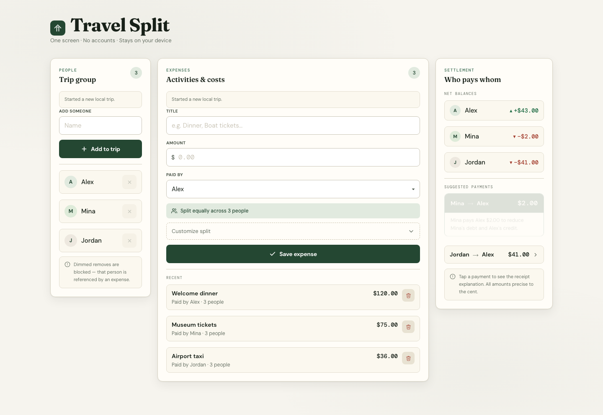
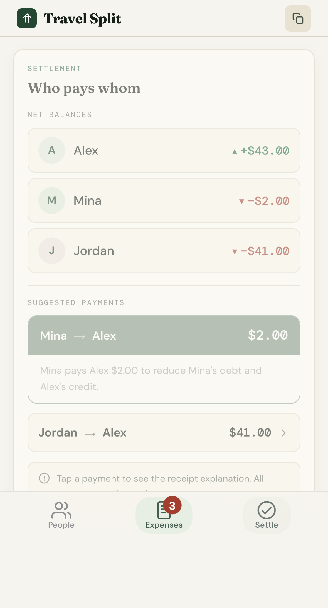
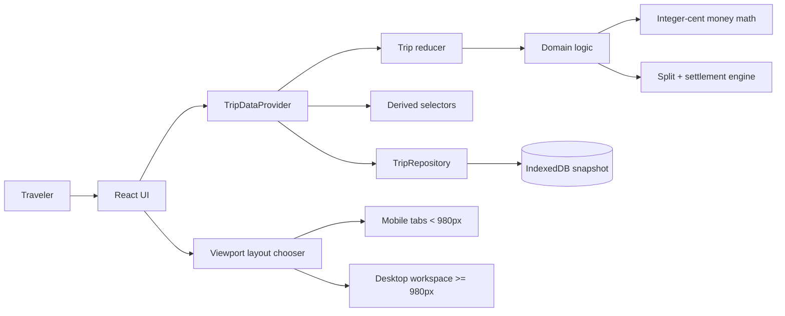
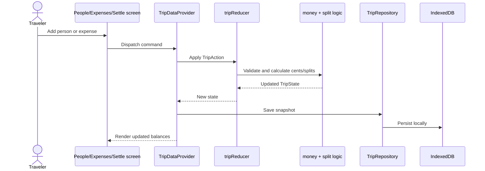

# Travel Split

Travel Split is a local-first trip expense splitter for small groups. It helps travelers record shared costs, see who paid for what, and settle up with clear suggested payments.

Live app: <https://eldesperado.github.io/travel-split/>

## Why this exists

Group trips create small money questions that become annoying fast: who paid for dinner, who owes for tickets, and what is the simplest way to settle without sending money back and forth unnecessarily.

Travel Split keeps that flow lightweight:

- no accounts
- no backend
- no payment connection
- no invite workflow
- no cloud sync

The goal is a private, single-device tool that works during a trip and produces a clear settlement answer at the end.

## Who it is for

Travel Split is for small travel groups that need a simple shared-expense ledger. It is especially useful when one person is comfortable keeping the trip record on their phone or laptop and showing or copying the result for the group.

## UI walkthrough

The screenshots below use a sample trip with three travelers — Alex, Mina, and Jordan — plus three shared expenses: welcome dinner, museum tickets, and airport taxi.

### Desktop workspace



The desktop UI is a three-column workspace:

1. **People** — the left panel manages the trip roster and shows that all three travelers are part of the current split.
2. **Expenses** — the center panel is the primary work area, showing the expense form plus recent trip costs.
3. **Settlement** — the right panel is always visible, so every new expense immediately updates net balances and suggested payments.

This layout is optimized for planning or reviewing a trip on a laptop. The user can add people, record costs, and see settlement impact without switching screens.

### Mobile Settle tab



The mobile UI uses a bottom tab bar with three destinations:

- **People** — manage travelers.
- **Expenses** — record shared costs and show the expense count badge.
- **Settle** — review who pays whom.

The Settle tab turns the ledger into an action list: each traveler has a clear net balance, and suggested payments show the smallest set of transfers needed to settle the trip. The selected tab uses a filled pill around the icon and label, giving a clear active state while preserving large touch targets.

## Main features

- **Add people** — build the trip group quickly with local names.
- **Record expenses** — enter an activity, amount, payer, and split participants.
- **Equal and weighted splits** — default to equal splits, with support for custom weights.
- **Settlement suggestions** — calculate who should pay whom to settle balances.
- **Receipt-style explanations** — show why each suggested payment exists.
- **Local persistence** — save the active trip in the browser using IndexedDB.
- **Responsive layouts** — use a mobile tab layout below 980px and a desktop three-column workspace at wider widths.
- **Private by default** — trip data stays in the browser; there is no server-side storage.

## Product scope

This is a local-first MVP. It intentionally does not include:

- user accounts
- cloud sync
- multi-device collaboration
- invite links
- payment processing
- native mobile app packaging

Those are future product decisions, not accidental omissions.

## Architecture



### Data flow



### Design principles

- **Local-first:** data is stored in the browser, not on a server.
- **Pure domain logic:** money, splitting, selectors, and reducers are testable outside React.
- **Persistence seam:** `TripRepository` hides IndexedDB so a future SQLite store can be added without rewriting UI logic.
- **Deterministic money math:** amounts are stored as integer cents and allocated with stable rounding behavior.
- **Responsive shell:** viewport width selects mobile tabs or desktop workspace; both shells share the same domain and data provider.

## Tech stack

- React
- TypeScript
- Vite
- Tailwind CSS
- IndexedDB via `idb`
- Vitest for unit coverage
- Playwright for browser validation
- GitHub Actions + GitHub Pages for deployment

## Local development

```bash
npm ci
npm run dev
```

Run the full verification gate:

```bash
npm run verify
```

This runs unit tests with coverage, builds the app, and runs Playwright browser tests.

## Deployment

The app deploys automatically to GitHub Pages when commits are pushed to `main`.

Deployment workflow:

1. install dependencies with `npm ci`
2. install the Chromium Playwright browser
3. set the Vite base path for GitHub Pages
4. run `npm run verify`
5. build and upload `dist`
6. deploy through GitHub Pages

If verification fails, the previous successful GitHub Pages deployment remains live.

## Current status

Travel Split is deployed as a working static web app and validated on both desktop and mobile layouts.
