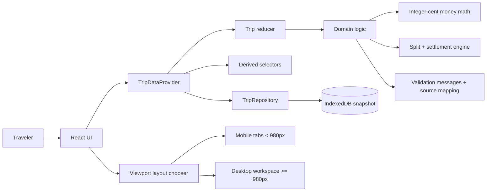
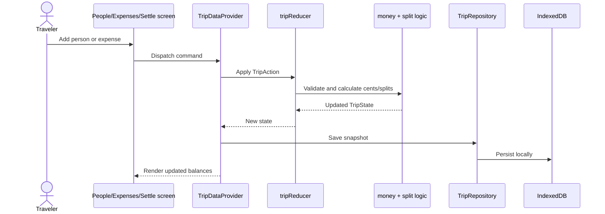

# Travel Split

Travel Split is a local-first trip expense splitter for small groups. It helps travelers record shared costs, see who paid for what, and settle up with clear suggested payments.

Live app: <https://eldesperado.github.io/travel-split/>

## Why this exists

Group trips create small money questions that become annoying fast: who paid for dinner, who owes for tickets, and what is the simplest way to settle without sending money back and forth unnecessarily.

Travel Split keeps that flow lightweight:

- no accounts
- no backend
- no payment connection
- no invite workflow
- no cloud sync

The goal is a private, single-device tool that works during a trip and produces a clear settlement answer at the end.

## Who it is for

Travel Split is for small travel groups that need a simple shared-expense ledger. It is especially useful when one person is comfortable keeping the trip record on their phone or laptop and showing or copying the result for the group.

## UI walkthrough

The screenshots below use a sample trip with three travelers — Alex, Mina, and Jordan — plus three shared expenses: welcome dinner ($120), museum tickets ($75), and airport taxi ($36). Click any image for the full-resolution version.

| Desktop workspace | Mobile · Expenses | Mobile · Settle |
| :---: | :---: | :---: |
| <a href="docs/screenshots/desktop-workspace.png"></a> | <a href="docs/screenshots/mobile-tabs.png"></a> | <a href="docs/screenshots/mobile-settle.png"></a> |
| Three-column layout: roster, expense form with recent list, and live settlement. | Bottom tab bar with the active Expenses pill and a count badge. | Net balances, suggested payments, and a selected-payment receipt. |

**Desktop** shows People, Expenses, and Settle side by side. Add a cost and the balances update immediately.

**Mobile** keeps the same flow in three tabs: People → Expenses → Settle. Helpful prompts take you to the next step, but you can still switch tabs anytime. On Settle, tap a payment to see why it is suggested.

## Main features

- **Add people fast** — after each person, the name field is ready for the next one.
- **Record shared costs** — add the title, amount, payer, and who should split it.
- **Edit or delete expenses** — fix saved costs in place.
- **Equal or weighted splits** — split evenly by default, or customize shares.
- **Settle up** — see the simplest payments to balance the trip.
- **Clear explanations** — tap a payment to see why it exists.
- **Helpful prompts** — empty screens and banners take you to the right next step.
- **Private by default** — data stays in your browser; there are no accounts or servers.

## Product scope

This is a local-first MVP. It intentionally does not include:

- user accounts
- cloud sync
- multi-device collaboration
- invite links
- payment processing
- native mobile app packaging

Those are future product decisions, not accidental omissions.

## Architecture



### Data flow



### Design principles

- **Local-first:** data is stored in the browser, not on a server.
- **Pure domain logic:** money, splitting, selectors, and reducers are testable outside React.
- **Persistence seam:** `TripRepository` hides IndexedDB so a future SQLite store can be added without rewriting UI logic.
- **Deterministic money math:** amounts are stored as integer cents and allocated with stable rounding behavior.
- **Responsive shell:** viewport width selects mobile tabs or desktop workspace; both shells share the same domain and data provider.
- **Guided flow:** People, Expenses, and Settle can point users to the next step while still allowing free navigation.
- **Scoped error surface:** validation errors carry a source (`people`, `expenses`, `global`) so each panel renders only its own; storage failures fall through as global. Source mapping lives in `src/domain/errors.ts`.
- **Plain-English micro-copy:** messages are short and action-led, like "Add an amount." or "Pick who paid."
- **Restrained motion:** the UI favors stable layout, clear focus rings, and calm hierarchy over decorative micro-animations.

## Tech stack

- React
- TypeScript
- Vite
- Tailwind CSS
- IndexedDB via `idb`
- Vitest for unit coverage
- Playwright for browser validation
- GitHub Actions + GitHub Pages for deployment

## Local development

```bash
npm ci
npm run dev
```

Run the full verification gate:

```bash
npm run verify
```

This runs unit tests with coverage, builds the app, and runs Playwright browser tests.

## Deployment

The app deploys automatically to GitHub Pages when commits are pushed to `main`.

Deployment workflow:

1. install dependencies with `npm ci`
2. install the Chromium Playwright browser
3. set the Vite base path for GitHub Pages
4. run `npm run verify`
5. build and upload `dist`
6. deploy through GitHub Pages

If verification fails, the previous successful GitHub Pages deployment remains live.

## Current status

Travel Split is deployed on GitHub Pages with desktop and mobile layouts, helpful next-step prompts, clear validation messages, calm UI styling, and local browser storage. Vitest covers the domain logic and prompt decisions; Playwright checks the People → Expenses → Settle flow end to end.
