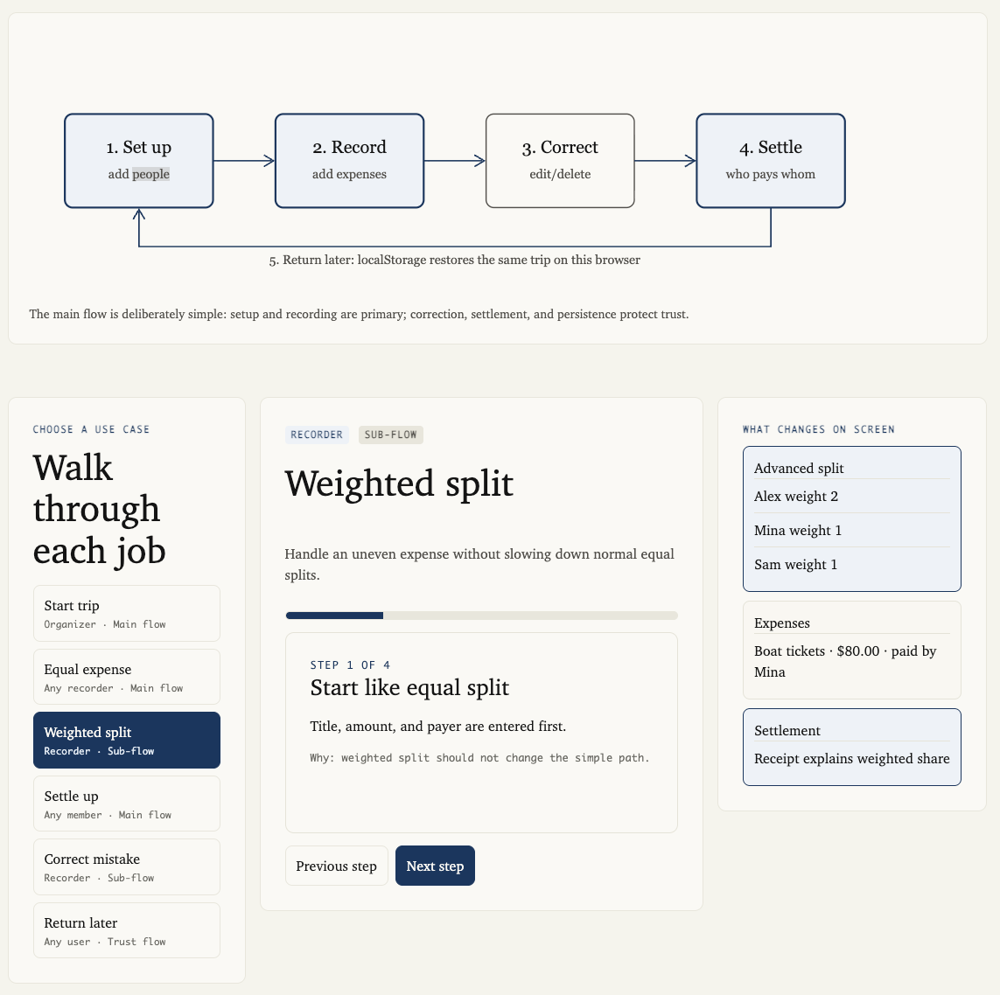
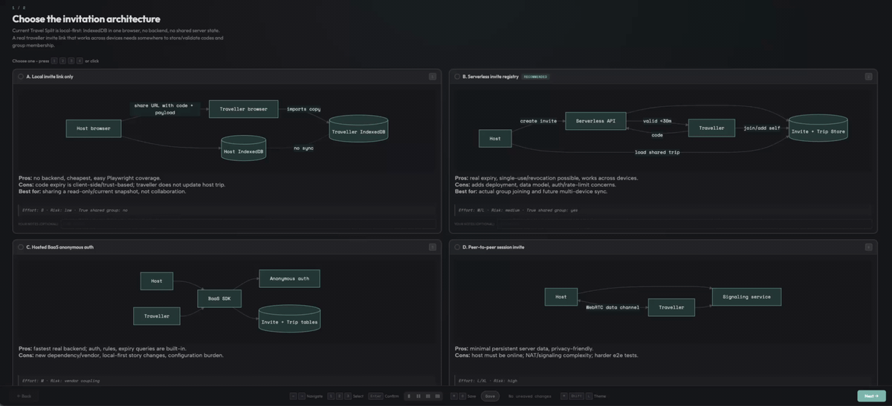
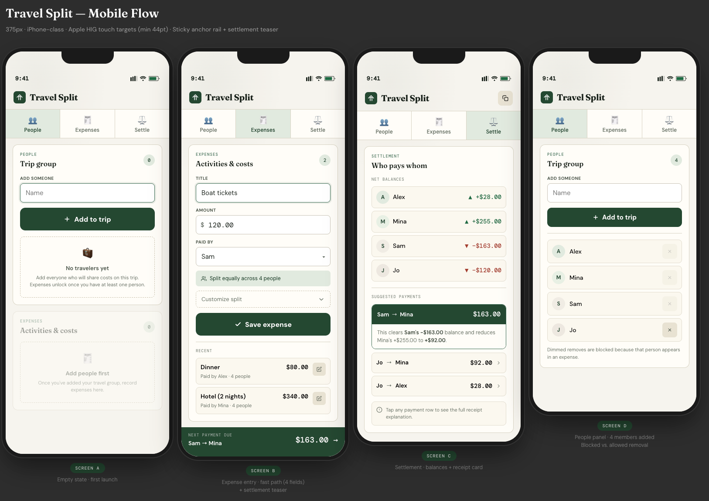
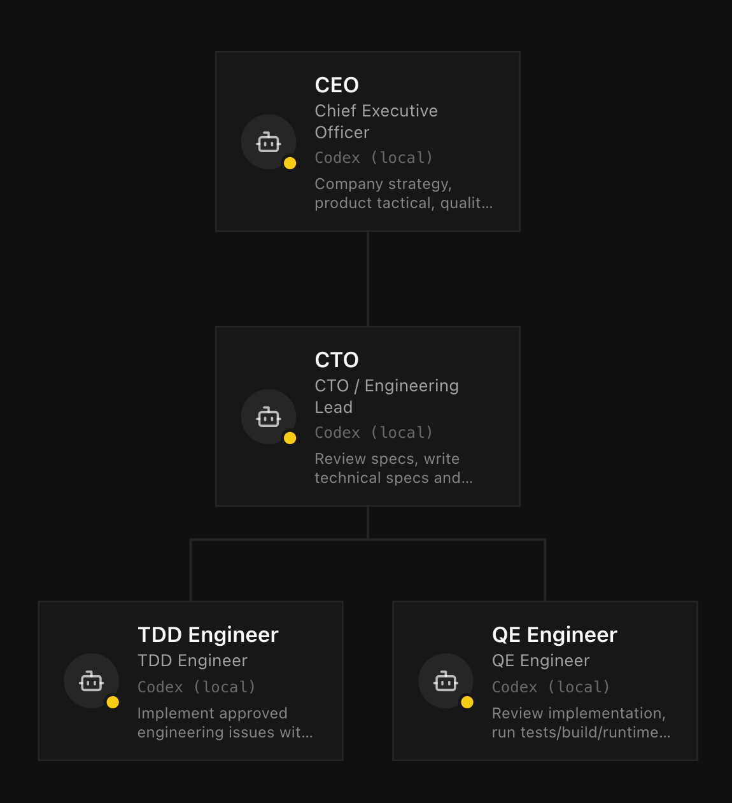

# Slide Outline: How I Built Travel Split with Agentic Engineering

## Deck intent

- **Audience:** People with no or basic AI background.
- **Goal:** Explain agentic engineering through the concrete story of building the Travel Split app.
- **Core message:** Agentic engineering is not “ask AI to write code.” It is a disciplined loop: understand the problem, plan with evidence, implement in small reversible steps, verify in the real product, and iterate.
- **Example app:** Travel Split — a local-first app for adding travelers, recording equal or weighted expenses, calculating balances, and suggesting settlements.

---

## 1. Title — “Building Travel Split with Agentic Engineering”

**Purpose:** Establish the app and the engineering theme.

**Key points:**

- Travel Split helps small travel groups track shared expenses and settle up.
- The interesting part is not only the app, but the way it was built.
- I used coding agents as engineering collaborators, not as a replacement for engineering discipline.

**Visual:** Product screenshot or simple app flow: People → Expenses → Settlement.

**Speaker note:** “This is a story about using AI to reduce cognitive load while increasing verification.”

---

## 2. What is agentic engineering?

**Purpose:** Define the central concept in beginner-friendly language.

**Key points:**

- **Agentic engineering:** developing software with coding agents inside a controlled engineering loop.
- The loop is: **solve problem → verify result → learn → repeat**.
- The human still owns product judgment, quality bar, and final decisions.
- The agent helps with reading, drafting, coding, testing, debugging, and validating.

**Contrast with vibe coding:**

| Vibe coding | Agentic engineering |
|---|---|
| “Use an LLM to write code.” | “Use agents to execute an engineering process.” |
| Optimizes for speed of output. | Optimizes for trustworthy progress. |
| Often stops when code looks plausible. | Stops only when evidence passes. |
| Hard to debug after the fact. | Uses tests, commits, logs, screenshots, and runtime checks as evidence. |

**Speaker note:** “The difference is the feedback loop. Agentic engineering makes the agent accountable to evidence.”

---

## 3. The Travel Split problem

**Purpose:** Ground the talk in a concrete product.

**Key points:**

- Users need to add people, record expenses, split costs fairly, and see who pays whom.
- Phase 1 was intentionally bounded:
  - one active trip
  - local-first browser storage
  - no accounts, backend, cloud sync, payments, OCR, or multi-currency conversion
- Product-critical rules:
  - money uses integer cents internally
  - default split weight is `1`
  - weighted splits must reconcile to cents
  - settlement suggestions must be deterministic and explainable

**Visual:** Simple constraint box: “Small scope, high trust.”

**Source references:**

- `docs/specs/2026-05-15-travel-split-specs.md`
- `docs/specs/2026-05-15-travel-split-plans.md`

---

## 4. Understanding — turning long specs into something humans can inspect

**Purpose:** Show how agents helped convert dense requirements into a more understandable artifact.

**Key points:**

- The original requirements were long Markdown documents.
- Long Markdown is easy for agents to read, but hard for humans to keep in working memory.
- I used agents to create self-contained HTML visualizations of the specs.
- The point was not decoration; it was comprehension.

**Reasoning:**

- Human cognitive load is scarce.
- Tokens are comparatively cheap.
- So I spent more tokens to produce richer visual artifacts that reduce human mental effort.

**Visual:**



**Speaker note:** “The agent can read hundreds of lines, but I need to understand the system quickly. Visual summaries let the human stay in control.”

---

## 5. Understanding output — from requirements to journeys and rules

**Purpose:** Explain what the visualization clarified.

**Key points:**

- The app decomposed into three primary areas:
  - People
  - Expenses
  - Settlement
- Core user journeys became explicit:
  - start a trip and add people
  - record equal-split expense
  - record weighted-split expense
  - edit/delete mistakes
  - reload persisted data
  - use on mobile
- Critical rules became test targets, not just text:
  - rounding
  - invalid weights
  - referenced-person deletion
  - corrupted stored data

**Visual:** Journey map or three-column flow.

**Useful repo artifacts:**

- `docs/specs/travel-split-user-journey-walkthrough.html`
- `docs/specs/travel-split-data-flow-sequence-plan.html`

---

## 6. Planning — use agents to research options before writing code

**Purpose:** Show planning as a separate engineering phase.

**Key points:**

- Before implementation, I used agents to explore possible solutions.
- The agent compared approaches by:
  - pros and cons
  - limitations
  - risks
  - implementation effort
  - maintenance cost
- The output became an implementation plan, not immediate code.

**Planning examples:**

- Where should split logic live? → pure TypeScript domain modules.
- How should state persist? → isolated storage adapter.
- How should UI be structured? → React components for interaction, not calculation rules.
- How should correctness be preserved? → unit tests + runtime validation.

**Visual:**



**Speaker note:** “Agents are useful for generating options. Engineering is choosing the option whose tradeoffs you can live with.”

---

## 7. Planning with visuals — from user journeys to design system and wireframes

**Purpose:** Show that planning also covered product flow and UI, not just code architecture.

**Key points:**

- User journeys defined the flows.
- Flows shaped the interface structure.
- The interface structure became a design system and wireframe:
  - one-screen workspace on desktop
  - tabbed mobile flow
  - clear sections for People, Expenses, Settlement
  - calm “paper-like” visual style

**Visual:**



**Speaker note:** “The visual plan helped catch complexity before it became code.”

---

## 8. Implementation — make progress reversible and inspectable

**Purpose:** Explain how Git and atomic commits support agentic work.

**Key points:**

- Git was the activity history.
- Work happened in small atomic commits.
- If something went wrong, I could:
  - revert a single change
  - compare diffs
  - ask an agent to inspect history
  - ask an agent to bisect the root cause
- This made the agent safer because every step left evidence.

**Concrete practices:**

- Keep domain logic separate from UI.
- Commit small behavior changes independently.
- Keep specs, plans, tests, and validation screenshots as artifacts.

**Speaker note:** “Agents are more useful when the repo has a clean memory. Git becomes the audit log.”

---

## 9. Implementation — tests first are a great fit for coding agents

**Purpose:** Explain why TDD pairs well with agents.

**Key points:**

- I wrote automated tests first, then implementation.
- Tests give the agent a clear target.
- Tests prevent “looks right” code from being treated as done.
- Tests also protect against future regressions when agents modify nearby code.

**Travel Split test targets:**

- money parsing and formatting
- split calculations
- settlement simplification
- reducer behavior
- storage validation
- mobile empty-state navigation
- edit-flow regressions

**Repo examples:**

- `src/domain/money.test.ts`
- `src/domain/split.test.ts`
- `src/domain/tripReducer.test.ts`
- `src/storage/tripRepository.test.ts`
- `e2e/travel-split.spec.ts`

**Speaker note:** “For an agent, tests are a reward function. They turn vague intent into executable feedback.”

---

## 10. Verification — success means tests pass and the real app works

**Purpose:** Introduce the stronger definition of “done.”

**Key points:**

- Unit tests are necessary but not enough.
- The app also needs real runtime validation.
- For Travel Split, success meant:
  - unit tests passed
  - production build passed
  - browser automation passed
  - desktop and mobile screenshots showed the UI working
  - persistence worked after reload
  - equal and weighted settlements produced expected results

**Command examples:**

```bash
npm test
npm run build
npm run test:e2e
npm run verify
```

**Speaker note:** “Passing tests tells me the logic works. Running the app tells me the product works.”

---

## 11. Give agents senses — eyes, hands, and ears

**Purpose:** Make runtime validation memorable for a non-AI audience.

**Key metaphor:** Agents are the brain. Tools give them senses.

| Sense | Tooling meaning | Travel Split example |
|---|---|---|
| Eyes | screenshots / visual inspection | see desktop and mobile UI states |
| Hands | browser automation / simulator interaction | click tabs, fill forms, save expenses |
| Ears | logs / errors / traces | hear app failures and runtime messages |

**Key points:**

- Without senses, the agent can only reason about code.
- With senses, the agent can observe the running product.
- This closes the loop between implementation and user experience.

**Repo artifacts:**

- `artifacts/runtime-validation.png`
- `artifacts/desktop-workspace-validation.png`
- `docs/screenshots/desktop-workspace.png`
- `docs/screenshots/mobile-settle.png`
- `docs/screenshots/mobile-tabs.png`

---

## 12. Iterate — human review or automated loops

**Purpose:** Explain iteration after initial implementation.

**Key points:**

- Iteration can be human-in-the-loop:
  - review a plan
  - inspect screenshots
  - approve tradeoffs
  - request changes
- Iteration can also be automated:
  - optimize against one clear metric
  - run experiment
  - measure result
  - keep or discard
- The important part is that every loop has a verification signal.

**Visual:**



**Speaker note:** “Agentic engineering scales when each loop has a clear success condition.”

---

## 13. What changed in my engineering workflow?

**Purpose:** Summarize practical lessons.

**Key points:**

- I moved effort earlier into understanding and planning.
- I used visuals to reduce cognitive load.
- I treated tests as instructions for agents.
- I treated Git as the shared memory and rollback system.
- I treated runtime validation as mandatory, not optional.
- I used agents for breadth and speed, while keeping human judgment on product intent and quality.

**Slide framing:** “AI did not remove engineering discipline. It made discipline more valuable.”

---

## 14. Closing — the agentic engineering loop

**Purpose:** End with a reusable model the audience can remember.

**Final loop:**

```text
Understand → Plan → Implement → Verify → Iterate
        ↑                              ↓
        └──────── learn from evidence ─┘
```

**Final takeaway:**

- Vibe coding asks: “Can the AI write this?”
- Agentic engineering asks: “Can we create a loop where the AI helps us make trustworthy progress?”

**Optional closing line:** “The future is not just faster code. It is faster feedback.”

---

## Appendix: Suggested deck structure if time is limited

For a shorter talk, compress to 8 slides:

1. Title: Building Travel Split with Agentic Engineering
2. Agentic engineering vs vibe coding
3. The Travel Split problem and constraints
4. Understanding specs through visual artifacts
5. Planning with tradeoff decks and user journeys
6. Implementation with atomic commits and tests first
7. Verification with tests + runtime senses
8. Iteration loop and final takeaway

---

## Appendix: Asset list

- Spec visualization: `docs/slides/assets/spec-visualization-example.png`
- Planning/design deck GIF: `docs/slides/assets/design-deck-example.gif`
- User journey/wireframe example: `docs/slides/assets/user-journey-wireframe-example.png`
- Iteration loop example: `docs/slides/assets/iteration-loop-example.png`
